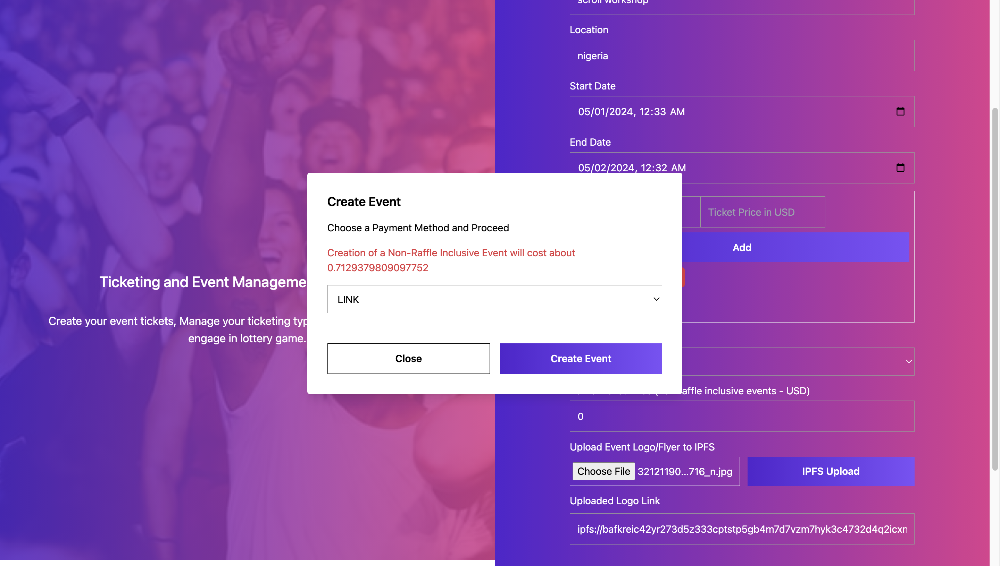
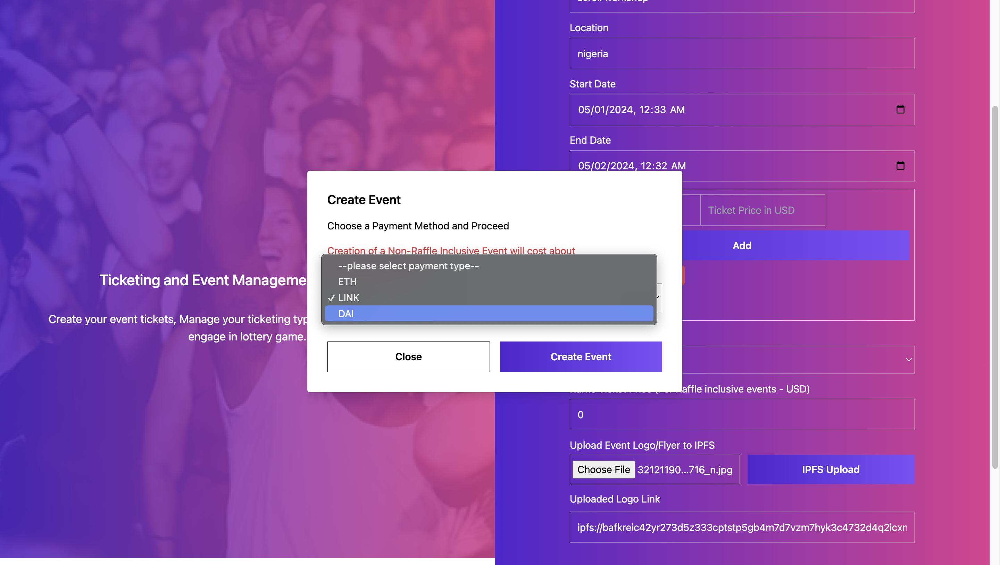
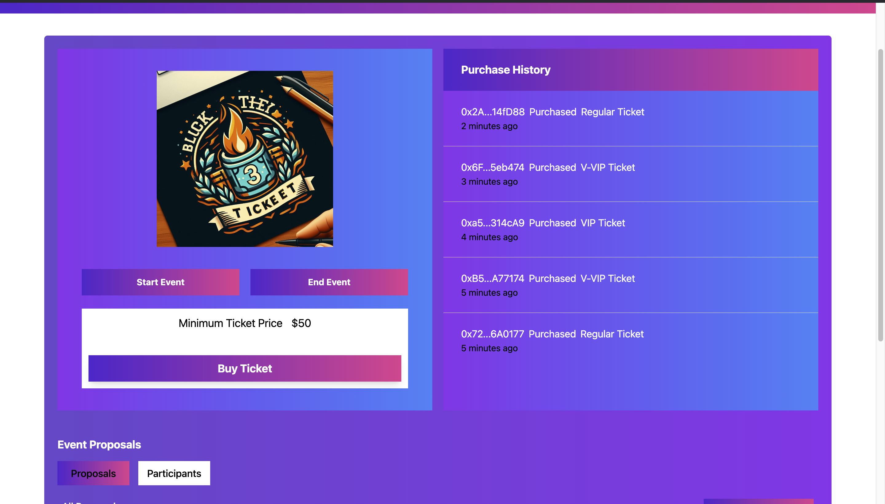

# Event Ticketing Management

This repository contains an event management system with these key functionalities.

1. A platform to create events with either ETH, DAI, LINK
2. An avenue for users to buy ticket for events you have created using either ETH, DAI or LINK
3. An avenue to add raffle draws to events you have created
4. Use of Random Number Generation (ZKVRF) to determine who wins an event raffle draw.
5. Verification of ticket using Zero Knowledge.

## MOTIVATION

The motivation behind building this project was to provide a practical solution to a real-world problem using blockchain technology. By adhering to the challenge requirements, this project aims to demonstrate the potential of dApps in event management.

## TECHNOLOGIES USED

- **Solidity:** This is the primary programming language for writing smart contracts on the Ethereum blockchain. It was used because of its robust features for developing secure and efficient contracts.

- **ZKVRF/contracts:** This is a set of smart contracts for the ZKVRF. It allows verified random numbers to be generated which will inturn be used to pick winners.

- **OpenZeppelin/contracts:** This is a library for secure smart contract development on Ethereum and other EVM-compatible blockchains. It provides implementations of standards like ERC20 and ERC721 which you can deploy as-is or extend to suit your needs, as well as Solidity components to build custom contracts and more complex decentralized systems. The Ownable contract was used to provide basic authorization control functions.

- **ScrollSepolia Chain:** This is the blockchain where the event management contract was deployed. Selected for its interoperability and performance. Lightlink is the best choice for this contract deployment.

- **ScrollScan:** This is the platform used for verifying the contract.

- **IPFS**: This is the platform for uploading of event logo

- **Chainlink Data Feeds**: Chainlink was used to fetch price feed for LINK, ETH and DAI (three modes of payment on the platform)

## SMART CONTRACT OVERVIEW

The following are functions used to implement the event management system.

- The `createEventEth` function to create a new event using eth.
- The `createEventERC20` function to create a new event using DAI or LINK.
- The `startEvent` function to start an event.
- The `endEvent` function to end an event.
- The `buyEventTicketEth` function to buy an event ticket using ETH.
- The `buyEventTicketERC20` function to buy an event ticket using either DAI or LINK.
- If the event is a raffle draw, call the `buyEventRaffleEth` function to buy a raffle draw ticket using ETH.
- If the event is a raffle draw, call the `buyEventRaffleERC20` function to buy a raffle draw ticket using either DAI or LINK.

## Event Factory SMART CONTRACT DETAIL

The smart contract `EventFactory` is a contract for managing events, including the creation of events, real-time data feed for price conversion.

The contract includes several functions to create events (raffle and non-raffle) and also implements chainlink data feed for checking the charges in desired tokens.

These functions are defined in the contract:

1. **miscelleneous**: This functions are for users to see how much value the USD payments are in their choise of payment tokens (ETH, DAI and LINK).

2. **createEventEth**: This function allows a user to an event. The user provides the event details, event ticket types. The function checks if the event details are valid and if the correct price has been paid for the ticket. Payment is made in ETH in USD value using chainlink price data feed.

3. **createEventERC20**: This function allows a user to an event. The user provides the event details, event ticket types, event creation price in either DAI or LINK price, and payment mode. The function checks if the event details are valid and if the correct price has been paid for the ticket. Payment is made in DAI or LINK using chainlink data feed.

## Event SMART CONTRACT DETAIL

The smart contract `Event` is a contract for managing events, including the creation of events, buying tickets, and conducting raffle draws.

The contract includes several structs to manage event details, participants, raffle draw information, and price categories. It also includes an enum to manage the status of events.

Mappings are used to manage events, participants, and raffle draw information. The contract also includes several error types to handle various error conditions.

The contract includes a constructor that sets the event details.

The contract includes several functions to manage events, including creating events, starting and ending events, buying tickets, and conducting raffle draws. It also includes view functions to get event details and participants.

These functions are defined in the contract:

1. **startEvent**: This function allows the creator of an event to start it. It checks if the event's start date has been reached and if the event is not already active or ended. It then sets the event's status to `Active`.

2. **endEvent**: This function allows the creator of an event to end it. It checks if the event's start date has been reached, if the event is ongoing, and if the raffle draw (if any) has ended. It then sets the event's status to `Ended` and transfers the total balance of the event to the creator.

3. **buyEventTicketEth**: This function allows a user to buy a ticket for an event. The user provides the ticket type ID and the ticket proof which was generated at the frontend. The function checks if the event is valid and if the correct price has been paid for the ticket. Payment is made in ETH. It then updates the event's total balance and stores the participant's details in the `_eventParticipants` mappings.

4. **buyEventTicketERC20**: This function allows a user to buy a ticket for an event. The user provides the ticket type ID and the ticket proof which was generated at the frontend. The function checks if the event is valid and if the correct price has been paid for the ticket. Payment is made in DAI or LINK. It then updates the event's total balance and stores the participant's details in the `_eventParticipants` mappings.

5. **buyEventRaffleEth**: This function allows a user to buy a raffle draw ticket for an event. The user provides the event raffle payment which is USD but payment is made using ETH. The function checks if the event is valid, if it's a raffle event, and if the correct price has been paid for the ticket. It then updates the event's eth total raffle price and stores the participant's details in the `_raffleDrawParticipants` array.

6. **buyEventRaffleERC20**: This function allows a user to buy a raffle draw ticket for an event. The user provides the event raffle payment which is USD but payment is made using either DAI or LINK. The function checks if the event is valid and which payment mode, if it's a raffle event, and if the correct price has been paid for the ticket. It then updates the event's eth total raffle price and stores the participant's details in the `_raffleDrawParticipants` array.

7. **getEvent**: This function allows a user to get the details of an event they created. It returns the event details from the `eventsMapping` mapping.

8. **raffleDrawParticipants**: This function allows a user to get the raffle draw participants of an event. It returns the participants from the `_raffleDrawParticipants` array.

9. **getRaffleDrawWinner**: This function allows a user to get the winner of a raffle draw for an event. It checks if the raffle draw event has been finalized and then returns the winner from the `raffleWinner` event state variable.

10. **executeRaffleDraw**: This function allows the creator of an event to start a raffle draw.The function checks if the event has started and if the correct fee has been paid. It then makes a request to the ZKVrf oracle and emits a `RequestedRandomNumber` which will then use the number to pick a random user as the lottery winner.

## WHY ZKVRF?

Once an event is created, a raffle draw can be created for that event. The winner of the raffle draw is determined using a random number generator which is provided using the zkvrf protocol used in the smart contract and shown in the technologies used section above.

## REWARDS

There are rewards for users who use this event and ticketing platform.

1. The User who wins the raffle draw based on the Random Number Generator is rewarded the total amount deposited to the raffle draw pool.
2. Users can make create events, buy tickets and participate in raffle draw and pay using either ETH, DAI and LINK which will be at the rate of the needed USD value.

## CONTRACT ADDRESS

## SCREENSHOTS

